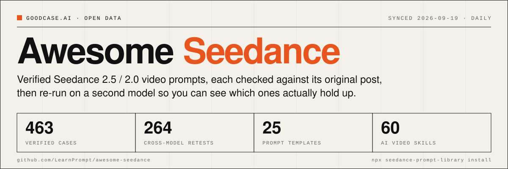
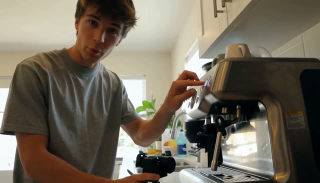
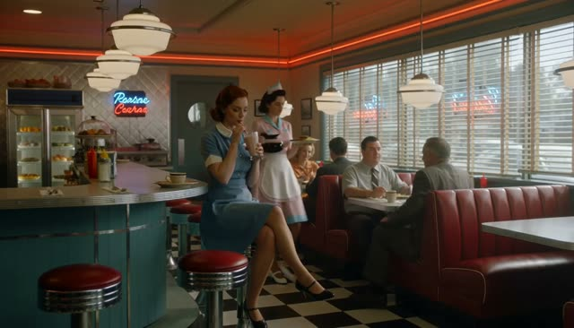
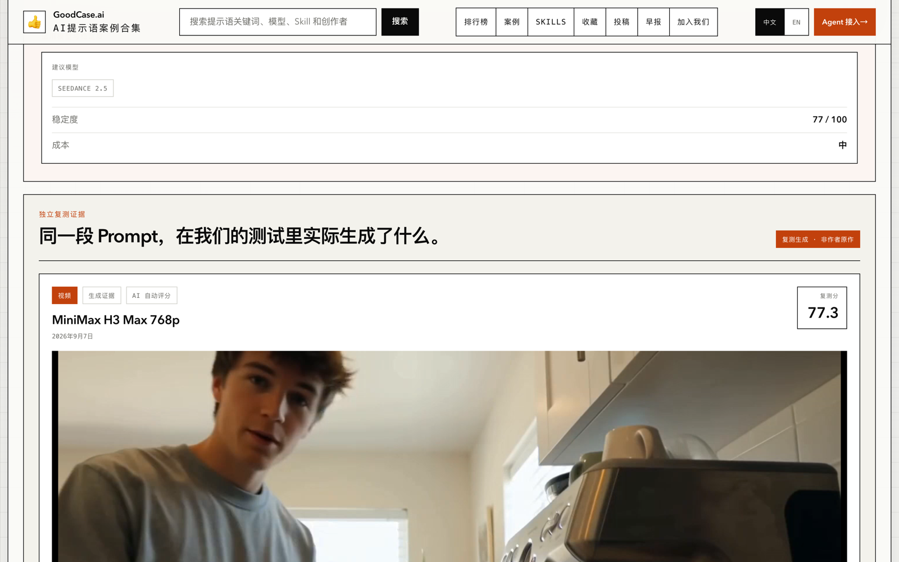

[English](./README.md) | **[中文](./README_zh.md)** | [日本語](./README_ja.md)

[](https://goodcase.ai/cases?filter=video&q=seedance&utm_source=awesome-seedance)

# Awesome Seedance [](https://awesome.re)

**Seedance 2.5 / 2.0 提示词验证库。** 419 条案例逐条核对过原帖，257 次跨模型复测，14 个可复用模板，24 个可安装的 AI 视频 Skill，背后是 goodcase.ai 横跨视频、图像、UI、文案的 1071 条已验证 AI 案例。每天同步，每天都有新案例进来。

[](#-all-prompts) [](#-cross-model-retests) [](#-prompt-templates) [](#install) [](https://goodcase.ai/cases?filter=video&q=seedance&utm_source=awesome-seedance) [](https://www.npmjs.com/package/seedance-prompt-library) [](./LICENSE) [](https://creativecommons.org/licenses/by/4.0/) [](./contributing.md)

更多经过验证、带完整 Prompt 的 AI 案例 → [GoodCase.ai](https://goodcase.ai/cases?filter=video&utm_source=awesome-seedance)

## 目录

- [快速入口](#快速入口)
- [安装](#安装)
- [为什么值得收藏这个仓库](#为什么值得收藏这个仓库)
- [🔁 跨模型复测](#-跨模型复测)
- [⭐ 精选](#-精选)
- [🗂️ 分类总览](#-分类总览)
- [🧩 Prompt 模板](#-prompt-模板)
- [🔥 热度 Top 30](#-热度-top-30)
- [🎬 全部案例](#-全部案例)
- [🌐 在 goodcase.ai 上浏览](#-在-goodcaseai-上浏览)
- [统计](#统计)
- [🚀 怎么用这个仓库](#-怎么用这个仓库)
- [如何投稿](#如何投稿)
- [🙏 致谢](#-致谢)
- [版权与下架政策](#版权与下架政策)
- [Star History](#star-history)
- [许可与复用](#许可与复用)

## 快速入口

直接跳到资产。下面的目录是本页章节地图。

- [画廊总览](https://github.com/LearnPrompt/awesome-seedance/blob/main/docs/gallery.zh.md) - 全部 419 条案例（含完整 prompt），所有分页一处可达。
- [Seedance 2.5](https://github.com/LearnPrompt/awesome-seedance/blob/main/docs/gallery-seedance-2-5.zh.md) - 43 条.
- [Seedance 2.0，第 1/2 页](https://github.com/LearnPrompt/awesome-seedance/blob/main/docs/gallery-seedance-2-0-part-1.zh.md) - 第 1–96 条.
- [Seedance 2.0，第 2/2 页](https://github.com/LearnPrompt/awesome-seedance/blob/main/docs/gallery-seedance-2-0-part-2.zh.md) - 第 97–130 条.
- [Seedance（未标版本），第 1/3 页](https://github.com/LearnPrompt/awesome-seedance/blob/main/docs/gallery-seedance-unversioned-part-1.zh.md) - 第 1–94 条.
- [Seedance（未标版本），第 2/3 页](https://github.com/LearnPrompt/awesome-seedance/blob/main/docs/gallery-seedance-unversioned-part-2.zh.md) - 第 95–190 条.
- [Seedance（未标版本），第 3/3 页](https://github.com/LearnPrompt/awesome-seedance/blob/main/docs/gallery-seedance-unversioned-part-3.zh.md) - 第 191–246 条.
- [Prompt 模板](https://github.com/LearnPrompt/awesome-seedance/blob/main/README_zh.md#-prompt-templates) - 6 类共 14 个可复用结构。
- [Agent Skill](https://github.com/LearnPrompt/awesome-seedance/tree/main/agents/skills/seedance-prompt-library) - `npx seedance-prompt-library install` 装进 Claude Code / Codex。
- [goodcase.ai 上更多 AI 视频 Skill](https://goodcase.ai/skills?category=video) - 23 个从视频案例里长出来的可安装 Skill。
- [goodcase.ai 在线站](https://goodcase.ai/cases?filter=video&q=seedance&utm_source=awesome-seedance) - 搜索、热度榜、稳定度榜、复测记录。
## 安装

```bash
npx seedance-prompt-library install
```

把 seedance-prompt-library 这个 Agent Skill 装进 Claude Code / Codex，让 agent 直接调结构化模板在你的编辑器里写 Seedance prompt。习惯用 [skills CLI](https://github.com/vercel-labs/skills) 的话，`npx skills add LearnPrompt/awesome-seedance --skill seedance-prompt-library` 装的是同一个 Skill。

想让 agent 直接查整个 goodcase.ai 案例库（全部模型、实时数据、复测基线）而不只是 Seedance 模板？装姊妹仓 [LearnPrompt/goodcase-lite](https://github.com/LearnPrompt/goodcase-lite) 里的 `goodcase` Skill：`npx skills add LearnPrompt/goodcase-lite --skill goodcase`。

## 为什么值得收藏这个仓库

**每条 prompt 都人工核对过与原帖一致。** 只靠成片视频反推出来的 prompt 一律不收，没有原帖来源不收，这是 [goodcase.ai 的收录标准](https://goodcase.ai/standards)（2026-08-05 起生效的红线）。

**在第二个模型上重跑过。** 大部分案例都拿到另一个视频模型上重新生成，结论、评分和产物都公开，见[跨模型复测](#-跨模型复测)。

**每条都带完整溯源。** 作者、原帖链接、发布时间、热度分，热度是同平台已发布案例里的相对分位，上不了榜就不收。

**自带可安装的 Agent Skill。** `npx seedance-prompt-library install` 一行装进 Claude Code / Codex，agent 用真实验证过的模板结构写 Seedance prompt，不是瞎编。

## 🔁 跨模型复测

**据我们所知，这是第一个把视频提示词批量拿到第二个模型上重跑、成败都公开的提示词库。** 这里已有 247 条案例被重跑过（累计 257 次），每次都带结论、评分和生成产物。只在作者手里、只在一个模型上成功过一次的 prompt 是截图；能扛住重跑的 prompt 才是方法。

| 模型                  | 次数  | 复现率 |
| ------------------- | --- | --- |
| MiniMax H3 Max 768p | 246 | 73% |
| MiniMax H3 768p     | 11  | 82% |

全部复测的结论分布：✅ 188 复现 · ⚠️ 66 降级 · ❌ 3 失败。没有终评分的记录显示为“无评分”。每条案例的结论、评分和产出视频都在它的 goodcase.ai 页面上；模型标签和批次日期的说明见[统计](#统计)。

**同一段 prompt，换一个模型。** 三个样例，其中一个没扛住：

| 案例                                                                                                   | 原作（Seedance）                                                                                                                                                                                       | 复测（第二个模型）                                                                                                                                                                                                                                                                                                                                                       | 结论             |
| ---------------------------------------------------------------------------------------------------- | -------------------------------------------------------------------------------------------------------------------------------------------------------------------------------------------------- | --------------------------------------------------------------------------------------------------------------------------------------------------------------------------------------------------------------------------------------------------------------------------------------------------------------------------------------------------------------- | -------------- |
| [首尔夏夜 Vlog](https://goodcase.ai/cases/vlog-c8171f712492)<br>2.5 · 热度 99                              | [](https://goodcase.ai/cases/vlog-c8171f712492)                                                | [](https://goodcase.ai/cases/vlog-c8171f712492)<br>MiniMax H3 Max 768p<br>[▶ 复测视频](https://media.goodcase.ai/retests/vlog-c8171f712492/video-minimax-h3-768p-20260907-phase1/generated.mp4)                                                                  | ✅ 复现 (75.7 分)  |
| [mini DV 咖啡 ASMR vlog](https://goodcase.ai/cases/seedance-25-minidv-coffee-asmr-vlog)<br>2.5 · 热度 99 | [](https://goodcase.ai/cases/seedance-25-minidv-coffee-asmr-vlog) | [](https://goodcase.ai/cases/seedance-25-minidv-coffee-asmr-vlog)<br>MiniMax H3 Max 768p<br>[▶ 复测视频](https://media.goodcase.ai/retests/seedance-25-minidv-coffee-asmr-vlog/video-minimax-h3-768p-20260907-phase1/generated.mp4) | ✅ 复现 (77.3 分)  |
| [复古餐厅时间冻结与倒放](https://goodcase.ai/cases/seedance-25-diner-frozen-time-rewind)<br>2.5 · 热度 100        | [](https://goodcase.ai/cases/seedance-25-diner-frozen-time-rewind)        | [](https://goodcase.ai/cases/seedance-25-diner-frozen-time-rewind)<br>MiniMax H3 Max 768p<br>[▶ 复测视频](https://media.goodcase.ai/retests/seedance-25-diner-frozen-time-rewind/video-minimax-h3-768p-20260907-phase1/generated.mp4)       | ⚠️ 降级 (63.9 分) |

[](https://goodcase.ai/cases/vlog-c8171f712492)

每次复测都是真金白银的推理费：到目前为止 257 次复测已超过 300 美元，按公开牌价算、不含任何折扣，别人复现同样的实验也是这个价。结果好坏我们都照发。 想把可灵、Veo、海螺或 Seedance 2.5 API 加进复测矩阵？[赞助一批复测 →](https://github.com/LearnPrompt/awesome-seedance/issues/new?title=Sponsor%20a%20retest%20batch&labels=sponsor)，或直接写邮件到 [carl@goodcase.ai](mailto:carl@goodcase.ai)。

## ⭐ 精选

按热度分排序的前 6 条，覆盖全部 Seedance 版本。长 prompt 默认折叠，点开展开。

### 复古餐厅时间冻结与倒放

> 一份 30 秒的时间冻结加倒放脚本：咖啡打翻的瞬间被锁死，镜头绕悬浮液带走完整圈，再让所有人和物倒回原位，最后一个招手把事故消解掉。

[](https://goodcase.ai/cases/seedance-25-diner-frozen-time-rewind)

**作者:** @techhalla | **来源:** [原帖](https://x.com/techhalla/status/2083389002552664385) | **发布:** 2026-08-01 | **热度:** 100

**稳定度：** 64/100

**复测：** MiniMax H3 Max 768p · 2026-09-07 · ⚠️ 降级 (63.9 分) · [产物](https://media.goodcase.ai/retests/seedance-25-diner-frozen-time-rewind/video-minimax-h3-768p-20260907-phase1/generated.mp4)

<details>
<summary><b>完整 prompt（13 行，点开展开）</b></summary>

```
Photorealistic cinematic 1950s American diner, chrome stools, red vinyl, neon glow and checkerboard floor, shot with modern lived-in realism and soft natural window light. Subtle handheld texture, warm practicals, rich period detail, heavy film grain.

0-4s: [Medium Wide] A striking young woman in her early 20s sits alone at the counter, calm and slightly amused, slowly sipping a tall thick milkshake through a straw. Behind her a young waitress in classic uniform approaches with a tray of eggs and bacon in one hand and a full glass coffee pot in the other. An older lady starts rising from a nearby booth.

4-8s: [Dynamic Tracking] The older lady collides hard into the waitress. Tray, plate, eggs, bacon and coffee pot explode upward in chaotic slow motion. Coffee erupts into long liquid ribbons and perfect suspended droplets. Camera immediately begins a smooth continuous orbit around the impact. Time locks completely at the peak of the spill. Every face freezes in pure shock. Only the girl at the counter keeps moving, completely unfazed.

8-17s: [Slow 360° Orbital] Camera glides in a full elegant orbit through the frozen diner. Coffee hangs in mid-air as glassy ribbons and spheres with perfect volume and surface tension. Bacon strips, eggs and the spinning tray float weightlessly. Patrons and waitress remain locked in startled expressions. The girl at the counter takes one slow, deliberate sip, eyes half-lidded, almost bored, while the entire frozen world (except her) begins an elegant reverse: every droplet, every piece of food and every person rewinds smoothly back to the exact starting positions.

17-24s: [Medium Shot] Rewind lands perfectly. Waitress stands balanced again with tray and coffee pot. The girl lifts her eyes, raises two fingers in a small casual gesture and softly calls the waitress by name. The waitress turns toward her just before the older lady begins to stand, completely avoiding the collision. A tiny private smile crosses the girl’s face.

24-30s: [Extreme Close-Up] Hard cut to her face as she takes one last slow sip. Soft knowing smile, eyes almost closed in quiet satisfaction, like she has done this a hundred times. Shallow depth of field, creamy bokeh of the neon diner behind her.

Photorealistic, ultra-detailed fluid physics, perfect motion blur only on moving elements, stable characters, cinematic lighting, heavy natural film grain, no artifacts, movie-level temporal coherence, high rewatch value.
```

</details>

**[🔍 在 goodcase.ai 查看（复测记录/稳定分）→](https://goodcase.ai/cases/seedance-25-diner-frozen-time-rewind)**

### 首尔夏夜 Vlog

> 一份详尽的脚本式提示词，用于创作一段展现首尔夏夜怀旧家庭录像风格的视频。

[](https://goodcase.ai/cases/vlog-c8171f712492)

**作者:** @AIwithkhan | **来源:** [原帖](https://x.com/AIwithkhan/status/2092971211169100048) | **发布:** 2026-08-27 | **热度:** 99

**稳定度：** 76/100

**复测：** MiniMax H3 Max 768p · 2026-09-07 · ✅ 复现 (75.7 分) · [产物](https://media.goodcase.ai/retests/vlog-c8171f712492/video-minimax-h3-768p-20260907-phase1/generated.mp4)

```
Create a 30-second, 1080p ultra-realistic personal home-video showing an ordinary summer evening in the life of a young Korean woman. No reference image. MAIN SUBJECT Young Korean woman in her early 20s, naturally pretty, realistic skin texture, minimal makeup, relaxed and approachable personality. Long black hair loosely tied into a messy side ponytail with a few loose strands around her face. Wearing a fitted pastel-blue short top, loose cream pajama-style pants, black sneakers and a simple silver necklace. Maintain the same face, hairstyle, clothing, body proportions and overall appearance throughout the entire video. SETTING A quiet older Seoul residential neighborhood during a warm summer evening. Narrow concrete lanes, small houses, potted plants, bicycles, old walls, utility poles, overhead wires, a tiny neighborhood bakery, a public water tap and large leafy trees casting shadows across the street. Everything should feel lived-in, ordinary and peaceful. CAMERA / VISUAL AESTHETIC Raw personal footage casually recorded by a friend on an early-2000s consumer DV camcorder. Strong handheld shake, imperfect framing, autofocus hunting, exposure shifts, occasional motion blur, faded colors, soft digital detail, mild noise, accidental zooms and natural camera imperfections. — OUTSIDE THE HOUSE She steps outside carrying a small reusable shopping bag. She locks the door, adjusts her messy ponytail and looks toward the camera with a relaxed smile. — BAKERY STOP She reaches a tiny neighborhood bakery and buys a warm pastry. She steps outside, takes her first bite and immediately smiles because it tastes good. She notices her friend filming and holds the pastry toward the camera playfully before taking another bite. — WALKING HOME She continues down the narrow street while eating. A neighborhood cat follows her for a few steps. She notices it, crouches down and gently pets it. — SMALL ACCIDENT She walks beneath a large tree when a few leaves fall onto her hair. She stops, looks confused, then realizes what happened and laughs. — QUIET MOMENT She reaches a low concrete wall beside the street and sits down for a moment. — FINAL MOMENT She stands up and continues walking home.
```

**[🔍 在 goodcase.ai 查看（复测记录/稳定分）→](https://goodcase.ai/cases/vlog-c8171f712492)**

### 双人 K-pop MV 逐镜分镜

> 把 30 秒切成十几段两到四秒的镜头，每段写死机位、景别、背景和动作，两个女生用粉发和黑发做外观锚点贯穿全片。值钱的是这套时间码排镜法。

[](https://goodcase.ai/cases/seedance-25-kpop-mv-dual-idol)

**作者:** @Just_sharon7 | **来源:** [原帖](https://x.com/Just_sharon7/status/2083422886686031982) | **发布:** 2026-08-01 | **热度:** 99

**稳定度：** 74/100

**复测：** MiniMax H3 Max 768p · 2026-09-07 · ⚠️ 降级 (74.2 分) · [产物](https://media.goodcase.ai/retests/seedance-25-kpop-mv-dual-idol/video-minimax-h3-768p-20260907-phase1/generated.mp4)

```
30-second ultra-realistic K-pop MV featuring two young East Asian women with flawless synchronization, cinematic lighting, glossy skin, realistic hair and fabric physics, natural body motion, and 4K live-action quality. Vibrant hot pink, electric blue, and silver color palette. 0–2s: Wide shot in a bright circular pink studio with reflective floor. Pink-haired woman (left) and black-haired woman (right) perform energetic opening pose and synchronized dance. 2–4s: Medium close-up of the black-haired woman on a blue spotlight stage, confidently pointing at the camera. 4–6s: Pink-haired woman dances before shimmering blue-silver tinsel curtains, dramatic hair flip and fluid arm movements. 6–8s: Back to the pink studio. Both perform synchronized choreography with sharp arm waves, hip sways, and strong formations. 8–10s: Extreme close-up of both faces against a blue background, glossy makeup, subtle smiles, and direct eye contact. 10–14s: Solo shots at the tinsel backdrop. Pink-haired woman mouths lyrics and gestures confidently, followed by the black-haired woman with relaxed jacket styling. 14–18s: Pink studio. Coordinated jacket choreography, hair flips, powerful synchronized dance, ending hands-on-hips. 18–22s: Glamour close-ups. Black-haired woman under glittering bokeh lights, then pink-haired woman with wind-blown hair against a soft pink background. 22–24s: Blue spotlight stage. Mirrored black-haired performer effect with synchronized spins and flowing hair. 24–26s: Both walk confidently toward the camera in front of shimmering tinsel curtains, reflections visible on the floor. 26–29s: Final synchronized dance and ending pose in the pink circular studio, standing together and looking into the camera. Style: Hyper-realistic live action, Seedance 2.5-quality motion realism, perfect lip sync, natural weight shifts, flowing hair, realistic fabric simulation, polished K-pop music video cinematography.
```

**[🔍 在 goodcase.ai 查看（复测记录/稳定分）→](https://goodcase.ai/cases/seedance-25-kpop-mv-dual-idol)**

### mini DV 咖啡 ASMR vlog

> 用家用摄像机的缺陷反向做真实感：手抖、来回找焦、曝光漂移、磁带颗粒全写进提示词，再配一份 ASMR 声音清单和每段三秒的分镜节奏。

[](https://goodcase.ai/cases/seedance-25-minidv-coffee-asmr-vlog)

**作者:** @Strength04_X | **来源:** [原帖](https://x.com/Strength04_X/status/2083094742682787939) | **发布:** 2026-07-31 | **热度:** 99

**稳定度：** 77/100

**复测：** MiniMax H3 Max 768p · 2026-09-07 · ✅ 复现 (77.3 分) · [产物](https://media.goodcase.ai/retests/seedance-25-minidv-coffee-asmr-vlog/video-minimax-h3-768p-20260907-phase1/generated.mp4)

<details>
<summary><b>完整 prompt（17 行，点开展开）</b></summary>

```
CAMERA / LOOK: Handheld mini DV camcorder footage filmed by the subject herself. Slight hand shake, occasional focus hunting, imperfect framing, natural zoom adjustments, soft tape-like image quality, subtle grain, realistic auto-exposure shifts from bright kitchen morning light. Natural skin tones, mild motion blur, authentic consumer camcorder aesthetic.
STYLE: Cozy coffee-prep vlog with gentle ASMR elements. Relaxed pacing, minimal dialogue, candid moments. Focus on satisfying sounds: bean grinder whirring, portafilter tamping, steam wand hissing, cup clinking, milk frothing.
SUBJECT: Young man in his mid-20s, plain t-shirt, hair slightly tousled, minimal accessories. Calm, focused energy while making his morning coffee.
SETTING: Small kitchen counter with an espresso machine on a bright morning. Natural daylight, coffee beans and a mug nearby, quiet atmosphere.
STORYBOARD:
→ (3s, propped medium shot) Places camera on the counter, switches on the machine. "Morning coffee, the proper way."
→ (3s, overhead shot) Grinds fresh coffee beans, fine grounds falling into the portafilter.
→ (3s, close-up) Tamps the grounds down firmly and evenly.
→ (3s, handheld shot) Locks the portafilter into the machine. "Here we go."
→ (3s, detail shot) Espresso streams slowly into a small cup. No dialogue.
→ (3s, medium shot) Pours cold milk into a small steel pitcher. "Time for the milk."
→ (3s, macro shot) Steam wand hissing as it froths the milk.
→ (3s, propped shot) Pours frothed milk carefully over the espresso, forming light layers.
→ (3s, warm ending shot) Holds the finished cup, takes a small sip, satisfied smile. "That's exactly what I needed."
→ (3s, final shot) Reaches toward camera, still holding the cup. "See you later." Hand covers lens as recording ends.
AUDIO NOTES: Natural kitchen ambience — grinder whirring, tamping, steam hissing, milk pouring should be clearly audible. Dialogue quiet and casual.
REALISM NOTES: Authentic body language, natural blinking, genuine focused smiles, occasional careful pauses while pouring, imperfect framing, focus breathing, bright morning light shifts. Should resemble a genuine personal coffee vlog on a consumer camcorder, not a commercial or AI-generated production.
```

</details>

**[🔍 在 goodcase.ai 查看（复测记录/稳定分）→](https://goodcase.ai/cases/seedance-25-minidv-coffee-asmr-vlog)**

### Create a 30-second, 1080p ultra-realistic emotional live-action scene…

> Pure emotions 😭 Can Hollywood match it ? Seedance 2.5 Prompt : Create a 30-second, 1080p ultra-realistic emotional live-action scene about a young woman discov…

[](https://goodcase.ai/cases/seedance-create-a-30-second-1080p-ultra-realistic-emotional-live-action-scene-about-a-y-8c4cbeb0026b)

**作者:** @AIwithSynthia | **来源:** [原帖](https://x.com/AIwithSynthia/status/2096439253970395531) | **发布:** 2026-09-06 | **热度:** 95

<details>
<summary><b>完整 prompt（54 行，点开展开）</b></summary>

```
Create a 30-second, 1080p ultra-realistic emotional live-action scene about a young woman discovering her boyfriend kissing another woman inside a quiet café. Focus entirely on authentic human emotion, natural crying, subtle facial expressions and believable body language. No melodrama or exaggerated acting.
MAIN CHARACTER
Young Korean woman in her early 20s, naturally beautiful, realistic skin texture, minimal makeup, long black hair loosely styled, wearing a fitted pastel-pink top, casual denim shorts and simple sneakers.
Maintain the exact same face, hairstyle, outfit, body proportions and appearance throughout the entire scene.
LOCATION
A cozy modern café on a rainy evening. Warm interior lighting, large windows covered with rain droplets, wooden tables, soft background chatter, cups and plates, a few customers quietly talking.
SCENE
She enters the café carrying a small handbag, casually looking around for her boyfriend.
She suddenly notices him sitting at a table near the window.
He is kissing another young woman.
She immediately stops walking.
Her expression changes from confusion to disbelief.
She slowly lowers her handbag.
She stares at them silently for a few seconds, struggling to process what she is seeing.
Her eyes begin to fill with tears.
Show realistic tears naturally forming along her lower eyelids, then slowly rolling down her cheeks. No exaggerated crying.
She takes a shaky breath.
She walks toward their table.
Her boyfriend notices her.
His expression immediately changes to shock.
The other woman turns around and becomes uncomfortable.
The girlfriend looks directly at him with trembling eyes and quietly says:
“How could you do this to me?”
Her voice cracks naturally.
She wipes one tear from her cheek, but more tears continue falling.
Her boyfriend stands up and tries to explain.
She shakes her head and takes a small step backward.
She says through tears:
“I trusted you.”
She looks at him for one final moment.
Her expression shows heartbreak, disappointment and disbelief rather than anger.
She turns around and walks toward the café door while quietly crying.
Her boyfriend takes one step after her but stops.
She reaches the door, pauses briefly, wipes her face and leaves.
The camera remains inside the café as the door closes behind her.
CAMERA / VISUAL STYLE
Handheld cinematic camera with subtle natural movement. Start with a medium shot following her into the café, then slowly move closer when she notices the couple.
Use realistic close-ups of her eyes, trembling lips, tears and subtle facial reactions.
Natural shallow depth of field, realistic skin pores, authentic reflections in the café windows, soft rainy evening light, natural motion blur, 24fps, photorealistic live-action.
Do not make her crying look beautiful or glamorous. It should look spontaneous, uncomfortable and emotionally real.
AUDIO
Rain against the café windows, quiet conversations, cups being placed on tables, distant café ambience, footsteps and subtle breathing.
No background music.
No narration.
Dialogue should sound natural with slight pauses, trembling voice and emotional breathing.
EMOTIONAL DIRECTION
The emotion should build gradually:
confusion → realization → shock → disbelief → tears → confrontation → heartbreak → quiet acceptance.
Avoid screaming, physical aggression or exaggerated dramatic gestures.
CONTINUITY / REALISM
Keep tears physically consistent once they appear. Tears should remain visible on her cheeks and naturally accumulate as she continues crying.
Maintain consistent clothing, hairstyle, jewelry and facial identity.
No sudden emotional changes, no disappearing tears, no duplicated people, no changing café layout, no unnatural body movements.
NEGATIVE: plastic skin, fake tears, exaggerated crying, cartoon expressions, melodramatic acting, screaming, physical violence, distorted faces, extra fingers, identity drift, outfit changes, CGI
```

</details>

**[🔍 在 goodcase.ai 查看（复测记录/稳定分）→](https://goodcase.ai/cases/seedance-create-a-30-second-1080p-ultra-realistic-emotional-live-action-scene-about-a-y-8c4cbeb0026b)**

### Seedance 原生 UGC 竖屏手机跟拍短片

> Some people still think AI does't look real - This video just ended the argument Made with Seedance 2.5 1080p on maxfusi

[](https://goodcase.ai/cases/mightyking-seedance-ai-7bbc1d4f9ad9)

**作者:** @mightyking | **来源:** [原帖](https://x.com/mightyking/status/2089299068514148655) | **发布:** 2026-08-17 | **热度:** 95

**稳定度：** 71/100

**复测：** MiniMax H3 Max 768p · 2026-09-07 · ⚠️ 降级 (71.2 分) · [产物](https://media.goodcase.ai/retests/mightyking-seedance-ai-7bbc1d4f9ad9/video-minimax-h3-768p-20260907-phase1/generated.mp4)

<details>
<summary><b>完整 prompt（29 行，点开展开）</b></summary>

```
Raw vertical phone video (UGC), handheld throughout, filmed by a friend who walks with the group, casual sway, natural night lighting, wide-angle lens, deep focus.

Characters: The hero is a young woman with long dark hair in a deep-purple one-shoulder dress with a small shoulder bag. Her three friends: one in a dark brown dress, a blonde in a black wrap dress, a blonde in a white mini dress — party dresses and sandals. Laughing, spontaneous night-out energy.

Setting: A luxury marina at night — a stone quay along a narrow water slip flanked on both sides by large moored luxury yachts, big white hulls rising on either side, masts and rigging above, fenders on the hulls. Warm orange street lamps, palm trees, distant city lights. The yachts glow with blue-turquoise underwater LED lights spilling into the water; a yellow mooring line runs to the stone.

[0.0s–4.0s] — Wide tracking shot, eye level, camera moving backward. The camera walks backward ahead of the four women as they stroll toward it down the marina promenade, framed head-to-toe, laughing and chatting in French; warm lamplight and palm trees behind, slight handheld bob.

[4.0s–6.0s] — Medium shot, eye level, backward track + quick left pan. The woman in the purple dress surges ahead of the group toward the lens, one arm raised, hair flying; the camera, on their left, keeps tracking back and pans to hold her.

[6.0s–8.0s] — Medium-wide, camera tilts down-left to follow, whip motion. She reaches the quay edge between the moored luxury yachts and launches headfirst over the edge; the handheld camera whips left and tilts down to chase her off the stone.

[8.0s–10.0s] — High-angle wide, looking down at the water, slight jolt. From up on the quay the camera looks down as she plunges headfirst into the blue-turquoise water in the slip between the big yacht hulls — a big splash, the underwater lights glowing around the impact; the handheld frame jolts slightly with the motion.

[10.0s–13.0s] — High-angle medium, looking down, small handheld drift. She surfaces in the teal water, gasping and laughing up at the camera, hair slicked back, treading water.

[13.0s–16.0s] — Handheld tilt up and back down, slight zoom. The camera lifts off the water and tilts up to a person leaning on the deck railing of one of the moored luxury yachts, watching her in the water, then tilts back down and zooms slightly in on her still treading and laughing.

[16.0s–20.0s] — High-angle medium, tilting to follow her up. She swims to the stone quay wall, reaches up and grabs a thick dark mooring pole, and hauls herself out; the camera tilts upward with her as she rises from the water, legs braced on the stone.

[20.0s–23.0s] — Low/close medium at the quay edge, static handheld. She climbs onto the stone lip, rolls onto her side, soaked dress clinging, then pushes up to her feet; the camera holds close, catching the water running off her.

[23.0s–27.0s] — Medium shot, eye level, loose handheld reframe. Back on the promenade, dripping wet, she flips her long wet hair forward and wrings it out, laughing, as her friends and passing pedestrians move behind her.

[27.0s–30.0s] — Medium shot, eye level, camera settles. Still dripping, she straightens up and strikes a confident, playful pose for the camera — hand on hip, tossing her wet hair back with a big smile — her friends laughing around her; the camera holds on the pose to end.

Audio: Live sync sound — friends laughing and shouting excitedly in French, a scream at the leap, a big water splash, water sloshing against the yacht hulls, wet footsteps on stone, ambient night marina sounds. No music.

Style: Raw amateur vertical phone footage, natural night lighting, warm street lamps mixing with the turquoise underwater yacht glow, authentic handheld motion.
```

</details>

**[🔍 在 goodcase.ai 查看（复测记录/稳定分）→](https://goodcase.ai/cases/mightyking-seedance-ai-7bbc1d4f9ad9)**

## 🗂️ 分类总览

先从想要的画面类型入手，再打开该分类的模板，把它变成可复用的结构。每格都链到下方的模板和它背后的已验证案例。

<table>
<tr>
<td width="25%" valign="top" align="center"><b>🏗️ 时间轴与分镜脚本</b><br><sub>1 个模板 · 4 条已验证案例</sub><br><br><a href="https://goodcase.ai/cases/boa-hancock-water-obstacle-race-prompt"></a><br><sub>逐秒时间轴分镜脚本</sub><br><a href="#-结构基础2-个模板">查看模板</a> · <a href="https://goodcase.ai/cases/boa-hancock-water-obstacle-race-prompt">热度最高案例</a></td>
<td width="25%" valign="top" align="center"><b>🏗️ 参考图与身份锁定</b><br><sub>1 个模板 · 4 条已验证案例</sub><br><br><a href="https://goodcase.ai/cases/elsasofia-ai-seedance-ai-e087ab2aed4b"></a><br><sub>参考图身份锁定</sub><br><a href="#-结构基础2-个模板">查看模板</a> · <a href="https://goodcase.ai/cases/elsasofia-ai-seedance-ai-e087ab2aed4b">热度最高案例</a></td>
<td width="25%" valign="top" align="center"><b>📱 手持 UGC vlog</b><br><sub>1 个模板 · 4 条已验证案例</sub><br><br><a href="https://goodcase.ai/cases/seedance-25-minidv-coffee-asmr-vlog"></a><br><sub>手持 UGC vlog</sub><br><a href="#-真实感与-ugc2-个模板">查看模板</a> · <a href="https://goodcase.ai/cases/seedance-25-minidv-coffee-asmr-vlog">热度最高案例</a></td>
<td width="25%" valign="top" align="center"><b>📱 第一人称一镜到底</b><br><sub>1 个模板 · 4 条已验证案例</sub><br><br><a href="https://goodcase.ai/cases/seedance-2-5-gopro-94a73eef1dbf"></a><br><sub>第一人称一镜到底</sub><br><a href="#-真实感与-ugc2-个模板">查看模板</a> · <a href="https://goodcase.ai/cases/seedance-2-5-gopro-94a73eef1dbf">热度最高案例</a></td>
</tr>
<tr>
<td width="25%" valign="top" align="center"><b>🛍️ UGC 口播测评</b><br><sub>1 个模板 · 3 条已验证案例</sub><br><br><a href="https://goodcase.ai/cases/seedance-2-5-ugc-69e79f387106"></a><br><sub>UGC 口播测评带货</sub><br><a href="#-商业与产品3-个模板">查看模板</a> · <a href="https://goodcase.ai/cases/seedance-2-5-ugc-69e79f387106">热度最高案例</a></td>
<td width="25%" valign="top" align="center"><b>🛍️ 产品商业广告</b><br><sub>1 个模板 · 4 条已验证案例</sub><br><br><a href="https://goodcase.ai/cases/case-e53b614b0f42"></a><br><sub>电影级产品广告分镜</sub><br><a href="#-商业与产品3-个模板">查看模板</a> · <a href="https://goodcase.ai/cases/case-e53b614b0f42">热度最高案例</a></td>
<td width="25%" valign="top" align="center"><b>🛍️ 过程与变换蒙太奇</b><br><sub>1 个模板 · 4 条已验证案例</sub><br><br><a href="https://goodcase.ai/cases/case-429309e40d97"></a><br><sub>流程与变换蒙太奇</sub><br><a href="#-商业与产品3-个模板">查看模板</a> · <a href="https://goodcase.ai/cases/case-429309e40d97">热度最高案例</a></td>
<td width="25%" valign="top" align="center"><b>🎭 对白与口型同步</b><br><sub>1 个模板 · 4 条已验证案例</sub><br><br><a href="https://goodcase.ai/cases/noorlewisx-seedance-ai-b2d98861daf9"></a><br><sub>对白与表演节拍</sub><br><a href="#-叙事与表演2-个模板">查看模板</a> · <a href="https://goodcase.ai/cases/noorlewisx-seedance-ai-b2d98861daf9">热度最高案例</a></td>
</tr>
<tr>
<td width="25%" valign="top" align="center"><b>🎭 电影感叙事短片</b><br><sub>1 个模板 · 4 条已验证案例</sub><br><br><a href="https://goodcase.ai/cases/caden-flux-seedance-ai-8ffb5f062951"></a><br><sub>电影级叙事短片</sub><br><a href="#-叙事与表演2-个模板">查看模板</a> · <a href="https://goodcase.ai/cases/caden-flux-seedance-ai-8ffb5f062951">热度最高案例</a></td>
<td width="25%" valign="top" align="center"><b>🎨 动画与定格风格</b><br><sub>2 个模板 · 8 条已验证案例</sub><br><br><a href="https://goodcase.ai/cases/case-69e5879cc5a7"></a><br><sub>动漫与风格化画风固定 · 定格动画与步进节奏</sub><br><a href="#-风格化动画2-个模板">查看模板</a> · <a href="https://goodcase.ai/cases/case-69e5879cc5a7">热度最高案例</a></td>
<td width="25%" valign="top" align="center"><b>💥 打斗与物理奇观</b><br><sub>2 个模板 · 7 条已验证案例</sub><br><br><a href="https://goodcase.ai/cases/seedance-25-diner-frozen-time-rewind"></a><br><sub>打斗编排 · 时间冻结与倒放奇观</sub><br><a href="#-动作舞蹈特效3-个模板">查看模板</a> · <a href="https://goodcase.ai/cases/seedance-25-diner-frozen-time-rewind">热度最高案例</a></td>
<td width="25%" valign="top" align="center"><b>💥 卡点音乐视频</b><br><sub>1 个模板 · 4 条已验证案例</sub><br><br><a href="https://goodcase.ai/cases/seedance-25-kpop-mv-dual-idol"></a><br><sub>音乐卡点 MV</sub><br><a href="#-动作舞蹈特效3-个模板">查看模板</a> · <a href="https://goodcase.ai/cases/seedance-25-kpop-mv-dual-idol">热度最高案例</a></td>
</tr>
</table>

## 🧩 Prompt 模板

从最高热度案例里提炼出来的可复用 prompt 结构，按分类分组。每行一个模板；每个模板的完整结构、要点和坑都在 [Skill 参考文档](./agents/skills/seedance-prompt-library/references/style-library.md) 里，`npx seedance-prompt-library install` 会一起装上。

### 🏗️ 结构基础（2 个模板）

其他模板都建在这两套骨架上：怎么把一条片子切成有时间的段落，以及怎么让同一个人贯穿这些段落。

| 模板                                                                                                                                                                   | 适用场景                                                                         | 示例                                                                                                                                                                                                                                                           |
| -------------------------------------------------------------------------------------------------------------------------------------------------------------------- | ---------------------------------------------------------------------------- | ------------------------------------------------------------------------------------------------------------------------------------------------------------------------------------------------------------------------------------------------------------ |
| **[逐秒时间轴分镜脚本](./agents/skills/seedance-prompt-library/references/style-library.md#逐秒时间轴分镜脚本)**<br><sub>把片子切成首尾相接的时间段，每段带一个机位、一个主要动作和一行音效。整个案例库里承重最强的结构。</sub>        | 长度超过 8 秒，或者某件事必须发生在某个时刻。207 条里 63 条（30%）用了时间分段，在 Seedance 2.5 案例里这个比例升到 45%。 | [#1](https://goodcase.ai/cases/seedance-2-5-vlog-30-3b85f315bb08) [#2](https://goodcase.ai/cases/seedance-2-5-3f70c2f28d22) [#3](https://goodcase.ai/cases/seedance-2-5-f3651857750b) [#4](https://goodcase.ai/cases/boa-hancock-water-obstacle-race-prompt) |
| **[参考图身份锁定](./agents/skills/seedance-prompt-library/references/style-library.md#参考图身份锁定)**<br><sub>给每张参考图一个稳定 token，逐条列出要继承什么，再单独列出不许继承什么。能不能生效，差别就在后面那条不继承声明。</sub> | 任何需要一张脸、一套衣服、一个产品或一套 UI 布局跨镜头存活的片子。2.0 和 2.5 都适用，2.5 还能用同一套 token 语法引用音频和视频。 | [#1](https://goodcase.ai/cases/elsasofia-ai-seedance-ai-e087ab2aed4b) [#2](https://goodcase.ai/cases/liyue-ai-seedance-ai-dd263958ed42) [#3](https://goodcase.ai/cases/case-79acf1a3e8a6) [#4](https://goodcase.ai/cases/seedance-2-5-ui-228cf63ce8ff)       |

### 📱 真实感与 UGC（2 个模板）

靠写相机缺陷、身体损耗和消费级镜头换真实感的模板，不靠堆画质词。

| 模板                                                                                                                                                              | 适用场景                                                  | 示例                                                                                                                                                                                                                                                         |
| --------------------------------------------------------------------------------------------------------------------------------------------------------------- | ----------------------------------------------------- | ---------------------------------------------------------------------------------------------------------------------------------------------------------------------------------------------------------------------------------------------------------- |
| **[手持 UGC vlog](./agents/skills/seedance-prompt-library/references/style-library.md#手持-ugc-vlog)**<br><sub>用相机缺陷换真实感。指名一个具体的消费级器材年代，把它的毛病写成要求，再手动关掉电影感。</sub>   | 要私人感的素材：日常、旅拍、健身、做饭、出门前准备。目标是像真有人拍的，而不是像很贵的时候用这套。     | [#1](https://goodcase.ai/cases/seedance-25-minidv-coffee-asmr-vlog) [#2](https://goodcase.ai/cases/16mm-analog-morning-vlog) [#3](https://goodcase.ai/cases/mightyking-seedance-ai-7bbc1d4f9ad9) [#4](https://goodcase.ai/cases/seedance-2-5-eba905fedcff) |
| **[第一人称一镜到底](./agents/skills/seedance-prompt-library/references/style-library.md#第一人称一镜到底)**<br><sub>执法记录仪、GoPro、FPV 和车把视角。相机挂在身体上，运动必须从身体推导，每一次剪辑都得手动声明。</sub> | 要观众就是操作者的沉浸素材：破门突入、极限运动、厨师视角做饭、无人机飞行。207 条里 32 条属于这类。 | [#1](https://goodcase.ai/cases/seedance-2-5-d68024212dfc) [#2](https://goodcase.ai/cases/seedance-2-5-gopro-94a73eef1dbf) [#3](https://goodcase.ai/cases/seedance-2-5-f1696dad13bc) [#4](https://goodcase.ai/cases/fpv-cd4a852a53ba)                       |

### 🛍️ 商业与产品（3 个模板）

广告型结构：产品要在微距、手部接触和英雄镜头里保持不变形。

| 模板                                                                                                                                                                   | 适用场景                                      | 示例                                                                                                                                                                                                                       |
| -------------------------------------------------------------------------------------------------------------------------------------------------------------------- | ----------------------------------------- | ------------------------------------------------------------------------------------------------------------------------------------------------------------------------------------------------------------------------ |
| **[UGC 口播测评带货](./agents/skills/seedance-prompt-library/references/style-library.md#ugc-口播测评带货)**<br><sub>创作者对着镜头开箱、上手、种草。要两把独立的锁——一把锁人，一把锁产品——台词焊进动作里。</sub>         | 带货型产品视频、开箱和创作者测评：产品要在被拿起、旋转、佩戴的过程中始终认得出来。 | [#1](https://goodcase.ai/cases/seedance-2-5-ugc-69e79f387106) [#2](https://goodcase.ai/cases/seedance-2-5-ugc-7de9338ecfc9) [#3](https://goodcase.ai/cases/case-b157d9c072bc)                                            |
| **[电影级产品广告分镜](./agents/skills/seedance-prompt-library/references/style-library.md#电影级产品广告分镜)**<br><sub>8 到 20 秒的精修广告：开头写死广告美学，中间是编号或计时的分镜拆解，结尾一个英雄镜头，最后甩一段关键词。</sub> | 美妆、饮品、珠宝、汽车、香水这类要读成投放级制作、不能读成创作者视频的广告。    | [#1](https://goodcase.ai/cases/luxury-skincare-commercial) [#2](https://goodcase.ai/cases/case-e53b614b0f42) [#3](https://goodcase.ai/cases/crimson-cola-99e9ec88e937) [#4](https://goodcase.ai/cases/case-7aea1313f63b) |
| **[流程与变换蒙太奇](./agents/skills/seedance-prompt-library/references/style-library.md#流程与变换蒙太奇)**<br><sub>烹饪步骤、改造延时、蓝图变房子、微缩城市组装。这类的手艺在于先声明什么不许变，再把变化按空间顺序排开。</sub>       | 主角是过程而不是人的片子：菜谱、建造、组装、前后对比。案例库里 35 条。     | [#1](https://goodcase.ai/cases/case-429309e40d97) [#2](https://goodcase.ai/cases/case-778d0c927488) [#3](https://goodcase.ai/cases/case-8bdac964f9d4) [#4](https://goodcase.ai/cases/case-179a06586ce5)                  |

### 🎭 叙事与表演（2 个模板）

有效载荷是剧情节拍或一句台词，不是画面质感。

| 模板                                                                                                                                                         | 适用场景                                                                             | 示例                                                                                                                                                                                                                                                                      |
| ---------------------------------------------------------------------------------------------------------------------------------------------------------- | -------------------------------------------------------------------------------- | ----------------------------------------------------------------------------------------------------------------------------------------------------------------------------------------------------------------------------------------------------------------------- |
| **[对白与表演节拍](./agents/skills/seedance-prompt-library/references/style-library.md#对白与表演节拍)**<br><sub>声明对白语种、标出说话人、把反应写成因果链而不是表情清单，每一拍以一个明确的结束状态收尾。</sub>     | 台词要被听见而不是被暗示的时候。207 条里 78 条把台词直接写进正文（38%），16 条显式管理口型。Seedance 2.5 还支持用上传的音轨驱动口型。 | [#1](https://goodcase.ai/cases/youmind-surprise-visit-romance-trailer) [#2](https://goodcase.ai/cases/noorlewisx-seedance-ai-b2d98861daf9) [#3](https://goodcase.ai/cases/case-1f8136a9893a) [#4](https://goodcase.ai/cases/case-a845e1418b39)                          |
| **[电影级叙事短片](./agents/skills/seedance-prompt-library/references/style-library.md#电影级叙事短片)**<br><sub>15 到 60 秒的多幕叙事。每幕带标题，角色卡写在幕之前，反转写成具体画面而不是一句会让人震惊。</sub> | 预告片、迷你剧、灾难段落、科幻悬念、爱情短片——观众要跟剧情而不是看质感的场合。                                         | [#1](https://goodcase.ai/cases/caden-flux-seedance-ai-8ffb5f062951) [#2](https://goodcase.ai/cases/sci-fi-mystery-message-from-2100) [#3](https://goodcase.ai/cases/mermaid-rescue-cinematic-story) [#4](https://goodcase.ai/cases/youmind-1980s-slasher-yacht-octopus) |

### 🎨 风格化动画（2 个模板）

非写实风格。画风必须写成可测量参数外加一份排除清单，否则会塌回通用 CG。

| 模板                                                                                                                                                               | 适用场景                                                   | 示例                                                                                                                                                                                                      |
| ---------------------------------------------------------------------------------------------------------------------------------------------------------------- | ------------------------------------------------------ | ------------------------------------------------------------------------------------------------------------------------------------------------------------------------------------------------------- |
| **[动漫与风格化画风固定](./agents/skills/seedance-prompt-library/references/style-library.md#动漫与风格化画风固定)**<br><sub>把画风写成可测量参数，再附一份相邻画风的排除清单。没有排除清单，动漫会塌成通用 3D 脸。</sub>     | 赛璐珞动作戏、吉卜力味日常、3D 卡通 RPG 战斗、2D 手绘烹饪。案例库里大约四分之一是各类风格化动画。 | [#1](https://goodcase.ai/cases/case-a9ab0266f96a) [#2](https://goodcase.ai/cases/case-a45446378e2a) [#3](https://goodcase.ai/cases/case-c32e6c3bb2c5) [#4](https://goodcase.ai/cases/case-ce63bf146d4e) |
| **[定格动画与步进节奏](./agents/skills/seedance-prompt-library/references/style-library.md#定格动画与步进节奏)**<br><sub>定格首先是时间规格，其次才是质感。写死帧率和保持帧数，指名工艺材质，再禁掉那三样会悄悄把它抹平的东西。</sub> | 黏土、剪纸、会动的油画、拼贴、台面物件动画。案例库里 24 条属于这一族。                  | [#1](https://goodcase.ai/cases/case-69e5879cc5a7) [#2](https://goodcase.ai/cases/case-b079faa80f0f) [#3](https://goodcase.ai/cases/case-0287a838e662) [#4](https://goodcase.ai/cases/case-50ba683413ff) |

### 💥 动作·舞蹈·特效（3 个模板）

由身体力学、节拍落点或一个物理奇观驱动的模板，场景描述只是背景。

| 模板                                                                                                                                                                                       | 适用场景                                                               | 示例                                                                                                                                                                                                                                                            |
| ---------------------------------------------------------------------------------------------------------------------------------------------------------------------------------------- | ------------------------------------------------------------------ | ------------------------------------------------------------------------------------------------------------------------------------------------------------------------------------------------------------------------------------------------------------- |
| **[打斗编排](./agents/skills/seedance-prompt-library/references/style-library.md#打斗编排)**<br><sub>打斗要成立，靠的是生物力学、接触点和连招链。写 epic fight 只会得到两个人互相挥空。</sub>                                       | 武术、剑戟、街头格斗、超能力位移和特技段落。案例库里 40 条，真人和动漫处理大致对半。                       | [#1](https://goodcase.ai/cases/just-sharon7-seedance-ai-8085c03efbb0) [#2](https://goodcase.ai/cases/yourplugai-seedance-ai-fb797edfc8e4) [#3](https://goodcase.ai/cases/case-f7e7c1862f38) [#4](https://goodcase.ai/cases/case-1a9a2c659866)                 |
| **[音乐卡点 MV](./agents/skills/seedance-prompt-library/references/style-library.md#音乐卡点-mv)**<br><sub>从 BPM 推出节拍锚点，把每一次剪辑、甩发和队形变化钉在真实重拍上，再把伴舞约束住，别让他们抢走视觉中心。</sub>                          | K-pop MV、翻跳、卡点健身剪辑、俱乐部演出片段。带音频锚点的写法只在 Seedance 2.5 上用，它接受音轨作为输入模态。 | [#1](https://goodcase.ai/cases/seedance-25-kpop-mv-zero-to-pop) [#2](https://goodcase.ai/cases/seedance-25-kpop-mv-dual-idol) [#3](https://goodcase.ai/cases/seedance-2-5-k-pop-87e2d00e2fe8) [#4](https://goodcase.ai/cases/vibrant-k-pop-stage-performance) |
| **[时间冻结与倒放奇观](./agents/skills/seedance-prompt-library/references/style-library.md#时间冻结与倒放奇观)**<br><sub>五拍骨架——日常、碰撞、峰值锁死、环绕、精确倒放——只留一个人不受冻结影响。案例库里同一作者换了物理材质把这套骨架重跑一遍，这就是它可迁移的直接证据。</sub> | 靠物理奇观而不是剧情撑起来的高互动短片。餐厅那版是整个案例库里互动最高的一条。                            | [#1](https://goodcase.ai/cases/seedance-25-diner-frozen-time-rewind) [#2](https://goodcase.ai/cases/youmind-rollercoaster-wig-time-freeze) [#3](https://goodcase.ai/cases/90s-diner-time-freeze-effect)                                                       |

## 🔥 热度 Top 30

全部版本里热度最高的 30 条（前 6 名同时在上方 ⭐ 精选里完整展示）。*完整 prompt* 跳到画廊里的完整条目，*原帖* 跳到创作者原帖。

| #   | 预览                                                                                                                                                                                                                                                                                                                                                      | 案例                                                                                                                                                                                                       | 版本   | 热度  | 复测             | 链接                                                                                                                                                                                                |
| --- | ------------------------------------------------------------------------------------------------------------------------------------------------------------------------------------------------------------------------------------------------------------------------------------------------------------------------------------------------------- | -------------------------------------------------------------------------------------------------------------------------------------------------------------------------------------------------------- | ---- | --- | -------------- | ------------------------------------------------------------------------------------------------------------------------------------------------------------------------------------------------- |
| 1   | [](https://goodcase.ai/cases/seedance-25-diner-frozen-time-rewind)                                                                                                                                                             | [复古餐厅时间冻结与倒放](https://goodcase.ai/cases/seedance-25-diner-frozen-time-rewind)                                                                                                                            | 2.5  | 100 | ⚠️ 降级 (63.9 分) | [完整 prompt](./docs/gallery-seedance-2-5.zh.md#复古餐厅时间冻结与倒放) · [原帖](https://x.com/techhalla/status/2083389002552664385)                                                                             |
| 2   | [](https://goodcase.ai/cases/vlog-c8171f712492)                                                                                                                                                                                                     | [首尔夏夜 Vlog](https://goodcase.ai/cases/vlog-c8171f712492)                                                                                                                                                 | 2.5  | 99  | ✅ 复现 (75.7 分)  | [完整 prompt](./docs/gallery-seedance-2-5.zh.md#首尔夏夜-vlog) · [原帖](https://x.com/AIwithkhan/status/2092971211169100048)                                                                              |
| 3   | [](https://goodcase.ai/cases/seedance-25-kpop-mv-dual-idol)                                                                                                                                                                      | [双人 K-pop MV 逐镜分镜](https://goodcase.ai/cases/seedance-25-kpop-mv-dual-idol)                                                                                                                              | 2.5  | 99  | ⚠️ 降级 (74.2 分) | [完整 prompt](./docs/gallery-seedance-2-5.zh.md#双人-k-pop-mv-逐镜分镜) · [原帖](https://x.com/Just_sharon7/status/2083422886686031982)                                                                     |
| 4   | [](https://goodcase.ai/cases/seedance-25-minidv-coffee-asmr-vlog)                                                                                                                                                      | [mini DV 咖啡 ASMR vlog](https://goodcase.ai/cases/seedance-25-minidv-coffee-asmr-vlog)                                                                                                                    | 2.5  | 99  | ✅ 复现 (77.3 分)  | [完整 prompt](./docs/gallery-seedance-2-5.zh.md#mini-dv-咖啡-asmr-vlog) · [原帖](https://x.com/Strength04_X/status/2083094742682787939)                                                                 |
| 5   | [](https://goodcase.ai/cases/seedance-create-a-30-second-1080p-ultra-realistic-emotional-live-action-scene-about-a-y-8c4cbeb0026b)                                                                 | [Create a 30-second, 1080p ultra-realistic emotional live-action scene…](https://goodcase.ai/cases/seedance-create-a-30-second-1080p-ultra-realistic-emotional-live-action-scene-about-a-y-8c4cbeb0026b) | 未标版本 | 95  | -              | [完整 prompt](./docs/gallery-seedance-unversioned-part-1.zh.md#create-a-30-second-1080p-ultra-realistic-emotional-live-action-scene) · [原帖](https://x.com/AIwithSynthia/status/2096439253970395531) |
| 6   | [](https://goodcase.ai/cases/mightyking-seedance-ai-7bbc1d4f9ad9)                                                                                                                                                  | [Seedance 原生 UGC 竖屏手机跟拍短片](https://goodcase.ai/cases/mightyking-seedance-ai-7bbc1d4f9ad9)                                                                                                                | 未标版本 | 95  | ⚠️ 降级 (71.2 分) | [完整 prompt](./docs/gallery-seedance-unversioned-part-1.zh.md#seedance-原生-ugc-竖屏手机跟拍短片) · [原帖](https://x.com/mightyking/status/2089299068514148655)                                                |
| 7   | [](https://goodcase.ai/cases/rishuavr-seedance-ai-ad4e6de3949d)                                                                                                                                                       | [Seedance 2.5 印尼女生日常写实短片](https://goodcase.ai/cases/rishuavr-seedance-ai-ad4e6de3949d)                                                                                                                   | 未标版本 | 95  | ✅ 复现 (77.5 分)  | [完整 prompt](./docs/gallery-seedance-unversioned-part-1.zh.md#seedance-25-印尼女生日常写实短片) · [原帖](https://x.com/RishuaVR/status/2089204108175741157)                                                    |
| 8   | [](https://goodcase.ai/cases/aiwithelisia-seedance-ai-b204cdfb3dac)                                                                                                                                                        | [金发少女在高中走廊释放超能力](https://goodcase.ai/cases/aiwithelisia-seedance-ai-b204cdfb3dac)                                                                                                                        | 未标版本 | 94  | ✅ 复现 (81.6 分)  | [完整 prompt](./docs/gallery-seedance-unversioned-part-1.zh.md#金发少女在高中走廊释放超能力) · [原帖](https://x.com/AiwithElisia/status/2092119695201837059)                                                        |
| 9   | [](https://goodcase.ai/cases/smartphone-beach-day-memories)                                                                                                                                                                        | [智能手机拍摄的海滩一日游回忆](https://goodcase.ai/cases/smartphone-beach-day-memories)                                                                                                                                | 2.0  | 93  | -              | [完整 prompt](./docs/gallery-seedance-2-0-part-1.zh.md#智能手机拍摄的海滩一日游回忆) · [原帖](https://x.com/Goodmanprotocol/status/2079189509586260101)                                                             |
| 10  | [](https://goodcase.ai/cases/mrdasonx-seedance-ai-ccaa50150259)                                                                                                                                                                  | [狐狸在森林溪流边自拍漫游](https://goodcase.ai/cases/mrdasonx-seedance-ai-ccaa50150259)                                                                                                                              | 未标版本 | 93  | ⚠️ 降级 (74.5 分) | [完整 prompt](./docs/gallery-seedance-unversioned-part-1.zh.md#狐狸在森林溪流边自拍漫游) · [原帖](https://x.com/MrDasOnX/status/2089969922617266257)                                                              |
| 11  | [](https://goodcase.ai/cases/seedance-269d1fc95820)                                                                                                                                                                                        | [不会有人认为这是真的吧？😄](https://goodcase.ai/cases/seedance-269d1fc95820)                                                                                                                                        | 未标版本 | 92  | ⚠️ 降级 (50.9 分) | [完整 prompt](./docs/gallery-seedance-unversioned-part-1.zh.md#不会有人认为这是真的吧) · [原帖](https://x.com/johnAGI168/status/2095025524586193105)                                                             |
| 12  | [](https://goodcase.ai/cases/seedance-use-the-uploaded-reference-image-as-the-exact-character-reference-214303ebc4cf) | [Use the uploaded reference image as the exact character reference](https://goodcase.ai/cases/seedance-use-the-uploaded-reference-image-as-the-exact-character-reference-214303ebc4cf)                   | 未标版本 | 92  | -              | [完整 prompt](./docs/gallery-seedance-unversioned-part-1.zh.md#use-the-uploaded-reference-image-as-the-exact-character-reference) · [原帖](https://x.com/AIwithkhan/status/2094997895187673489)       |
| 13  | [](https://goodcase.ai/cases/2d-38a41133eab1)                                                                                                                                                                                                      | [手绘 2D 日本料理动画](https://goodcase.ai/cases/2d-38a41133eab1)                                                                                                                                                | 2.0  | 91  | ⚠️ 降级 (55.9 分) | [完整 prompt](./docs/gallery-seedance-2-0-part-1.zh.md#手绘-2d-日本料理动画) · [原帖](https://x.com/riotboy2024/status/2092217560788000816)                                                                   |
| 14  | [](https://goodcase.ai/cases/youmind-paris-fashion-campaign-streetwear)                                                                                                                                             | [电影感巴黎时尚广告大片：五镜头街拍](https://goodcase.ai/cases/youmind-paris-fashion-campaign-streetwear)                                                                                                                 | 2.0  | 90  | ✅ 复现 (81.8 分)  | [完整 prompt](./docs/gallery-seedance-2-0-part-1.zh.md#电影感巴黎时尚广告大片五镜头街拍) · [原帖](https://x.com/Just_sharon7/status/2083793251132186998)                                                              |
| 15  | [](https://goodcase.ai/cases/lianaalane-seedance-ai-d70d42733c55)                                                                                                                                                                            | [Seedance 双角色 2D 动漫：小风筝的十四秒冒险](https://goodcase.ai/cases/lianaalane-seedance-ai-d70d42733c55)                                                                                                            | 未标版本 | 90  | ✅ 复现 (90.4 分)  | [完整 prompt](./docs/gallery-seedance-unversioned-part-1.zh.md#seedance-双角色-2d-动漫小风筝的十四秒冒险) · [原帖](https://x.com/Lianaalane/status/2089563357074559014)                                             |
| 16  | [](https://goodcase.ai/cases/aiwithelisia-seedance-ai-e7e817c4c4b8)                                                                                                                                            | [Seedance 2.0 电影感东亚女性生活方式短片](https://goodcase.ai/cases/aiwithelisia-seedance-ai-e7e817c4c4b8)                                                                                                            | 未标版本 | 90  | ✅ 复现 (86.8 分)  | [完整 prompt](./docs/gallery-seedance-unversioned-part-1.zh.md#seedance-20-电影感东亚女性生活方式短片) · [原帖](https://x.com/AiwithElisia/status/2088846290130190784)                                             |
| 17  | [](https://goodcase.ai/cases/boa-hancock-water-obstacle-race-prompt)                                                                                                                              | [Boa Hancock Water Obstacle Race Prompt](https://goodcase.ai/cases/boa-hancock-water-obstacle-race-prompt)                                                                                               | 2.5  | 89  | ⚠️ 降级 (66.3 分) | [完整 prompt](./docs/gallery-seedance-2-5.zh.md#boa-hancock-water-obstacle-race-prompt) · [原帖](https://x.com/Chengzilhy/status/2087458506123465088)                                                 |
| 18  | [](https://goodcase.ai/cases/real-case-06-aimikoda)                                                                                                                                                                                        | [梅林元素功夫表演](https://goodcase.ai/cases/real-case-06-aimikoda)                                                                                                                                              | 2.0  | 89  | -              | [完整 prompt](./docs/gallery-seedance-2-0-part-1.zh.md#梅林元素功夫表演) · [原帖](https://x.com/aimikoda/status/2054460932068200517)                                                                          |
| 19  | [](https://goodcase.ai/cases/zarairahh-seedance-ai-f89372941867)                                                                                                                                                                 | [猫咪自拍记录温馨的一天](https://goodcase.ai/cases/zarairahh-seedance-ai-f89372941867)                                                                                                                              | 未标版本 | 89  | ⚠️ 降级 (70.2 分) | [完整 prompt](./docs/gallery-seedance-unversioned-part-1.zh.md#猫咪自拍记录温馨的一天) · [原帖](https://x.com/ZaraIrahh/status/2091385137133219971)                                                              |
| 20  | [](https://goodcase.ai/cases/yesandyou-seedance-ai-2a9dc20c947d)                                                                                                                                                                  | [泥土中诞生的罐中小鸟](https://goodcase.ai/cases/yesandyou-seedance-ai-2a9dc20c947d)                                                                                                                               | 未标版本 | 89  | -              | [完整 prompt](./docs/gallery-seedance-unversioned-part-1.zh.md#泥土中诞生的罐中小鸟) · [原帖](https://x.com/Yesandyou_/status/2090075447195480403)                                                              |
| 21  | [](https://goodcase.ai/cases/aiwithnatalia-seedance-ai-7597faa7285f)                                                                                                                                                                                      | [十秒自救的女巫把自己变成了鸭子](https://goodcase.ai/cases/aiwithnatalia-seedance-ai-7597faa7285f)                                                                                                                      | 未标版本 | 89  | -              | [完整 prompt](./docs/gallery-seedance-unversioned-part-1.zh.md#十秒自救的女巫把自己变成了鸭子) · [原帖](https://x.com/AIwithNatalia/status/2089170554725265625)                                                      |
| 22  | [](https://goodcase.ai/cases/yesandyou-seedance-ai-d92a0a788b85)                                                                                                                                                 | [Seedance 2.5 超写实微距延时：种子发芽十秒](https://goodcase.ai/cases/yesandyou-seedance-ai-d92a0a788b85)                                                                                                              | 未标版本 | 89  | -              | [完整 prompt](./docs/gallery-seedance-unversioned-part-1.zh.md#seedance-25-超写实微距延时种子发芽十秒) · [原帖](https://x.com/Yesandyou_/status/2088998841395921185)                                               |
| 23  | [](https://goodcase.ai/cases/erling-haaland-525acabe78da)                                                                                                                                                                     | [Erling Haaland 黏土动画园艺](https://goodcase.ai/cases/erling-haaland-525acabe78da)                                                                                                                           | 2.0  | 88  | ✅ 复现 (83.3 分)  | [完整 prompt](./docs/gallery-seedance-2-0-part-1.zh.md#erling-haaland-黏土动画园艺) · [原帖](https://x.com/noorwithwifi/status/2079818537137475762)                                                         |
| 24  | [](https://goodcase.ai/cases/korean-fantasy-romance-drama)                                                                                                                                                            | [Korean Fantasy Romance Drama](https://goodcase.ai/cases/korean-fantasy-romance-drama)                                                                                                                   | 2.0  | 88  | ⚠️ 降级 (73.7 分) | [完整 prompt](./docs/gallery-seedance-2-0-part-1.zh.md#korean-fantasy-romance-drama) · [原帖](https://x.com/JuliaClarky/status/2079586851862835248)                                                   |
| 25  | [](https://goodcase.ai/cases/seedance-a-cinematic-30-second-tropical-travel-vlog-montage-featuring-a-beautiful-20-yea-6af38a792806)                                                                       | [A cinematic 30-second tropical travel vlog montage featuring a…](https://goodcase.ai/cases/seedance-a-cinematic-30-second-tropical-travel-vlog-montage-featuring-a-beautiful-20-yea-6af38a792806)       | 未标版本 | 88  | -              | [完整 prompt](./docs/gallery-seedance-unversioned-part-1.zh.md#a-cinematic-30-second-tropical-travel-vlog-montage-featuring-a) · [原帖](https://x.com/eshal__ai/status/2096840505355370629)           |
| 26  | [](https://goodcase.ai/cases/seedance-realism-that-makes-ordinary-life-feel-special-aa5751af1eff)                                                             | [Realism that makes ordinary life feel special](https://goodcase.ai/cases/seedance-realism-that-makes-ordinary-life-feel-special-aa5751af1eff)                                                           | 未标版本 | 88  | -              | [完整 prompt](./docs/gallery-seedance-unversioned-part-1.zh.md#realism-that-makes-ordinary-life-feel-special) · [原帖](https://x.com/Just_sharon7/status/2096109540924141746)                         |
| 27  | [](https://goodcase.ai/cases/just-sharon7-seedance-ai-9c64e481a51d)                                                                                                                                                                              | [Seedance 灾难现场拍还是跑：第一视角短片](https://goodcase.ai/cases/just-sharon7-seedance-ai-9c64e481a51d)                                                                                                              | 未标版本 | 88  | ✅ 复现 (79.3 分)  | [完整 prompt](./docs/gallery-seedance-unversioned-part-1.zh.md#seedance-灾难现场拍还是跑第一视角短片) · [原帖](https://x.com/Just_sharon7/status/2089578815219785888)                                               |
| 28  | [](https://goodcase.ai/cases/youmind-travel-vlog-city-to-beach)                                                                                                                                                             | [手持感旅行 Vlog：从公寓到海滩](https://goodcase.ai/cases/youmind-travel-vlog-city-to-beach)                                                                                                                         | 2.5  | 87  | -              | [完整 prompt](./docs/gallery-seedance-2-5.zh.md#手持感旅行-vlog从公寓到海滩) · [原帖](https://x.com/BubbleBrain/status/2083659648108990925)                                                                      |
| 29  | [](https://goodcase.ai/cases/seedance-create-a-30-second-ultra-cinematic-supernatural-fantasy-sequence-photorealisti-6d87ff7834d3)                                                                      | [Create a 30-second ultra-cinematic supernatural fantasy sequence…](https://goodcase.ai/cases/seedance-create-a-30-second-ultra-cinematic-supernatural-fantasy-sequence-photorealisti-6d87ff7834d3)      | 未标版本 | 87  | -              | [完整 prompt](./docs/gallery-seedance-unversioned-part-1.zh.md#create-a-30-second-ultra-cinematic-supernatural-fantasy-sequence) · [原帖](https://x.com/Zyrellix/status/2097594855946113177)          |
| 30  | [](https://goodcase.ai/cases/seedance-it-s-the-little-moments-that-make-ai-feel-this-real-57c748edf467)                                                                                                               | [It’s the little moments that make AI feel this real](https://goodcase.ai/cases/seedance-it-s-the-little-moments-that-make-ai-feel-this-real-57c748edf467)                                               | 未标版本 | 87  | -              | [完整 prompt](./docs/gallery-seedance-unversioned-part-1.zh.md#its-the-little-moments-that-make-ai-feel-this-real) · [原帖](https://x.com/SimplyAnnisa/status/2096931238460178592)                    |

## 🎬 全部案例

全部 419 条案例（含完整 prompt）都在 `docs/` 下的画廊里，按版本分文件、超长自动分页以保证 GitHub 能渲染。从[画廊总览](./docs/gallery.zh.md)进，或直接跳到某个版本：

- Seedance 2.5 - 43 条：[完整画廊](./docs/gallery-seedance-2-5.zh.md)。
- Seedance 2.0 - 130 条：[第 1 页（第 1–96 条）](./docs/gallery-seedance-2-0-part-1.zh.md) · [第 2 页（第 97–130 条）](./docs/gallery-seedance-2-0-part-2.zh.md)。
- Seedance（未标版本） - 246 条：[第 1 页（第 1–94 条）](./docs/gallery-seedance-unversioned-part-1.zh.md) · [第 2 页（第 95–190 条）](./docs/gallery-seedance-unversioned-part-2.zh.md) · [第 3 页（第 191–246 条）](./docs/gallery-seedance-unversioned-part-3.zh.md)。

## 🌐 在 goodcase.ai 上浏览

这份 README 是索引。完整体验在 [goodcase.ai](https://goodcase.ai/cases?filter=video&q=seedance&utm_source=awesome-seedance)：全库搜索、热度榜、稳定度榜、每条案例带产出视频的复测记录，以及从案例里长出来的可安装 Skill。这里每一条都链回它在 goodcase.ai 的记录页。

[](https://goodcase.ai/cases?filter=video&q=seedance&utm_source=awesome-seedance)

## 统计

| 指标                          | 数值                |
| --------------------------- | ----------------- |
| 本仓库 Seedance 案例             | 419               |
| Seedance 2.5                | 43                |
| Seedance 2.0                | 130               |
| Seedance（未标版本）              | 246               |
| 作者数                         | 158               |
| 跨模型复测                       | 247 条 / 257 次     |
| 稳定度分（已测）                    | 245 条 / 均分 78.0   |
| 最近更新                        | 2026-09-13        |
| goodcase.ai 全站（含非 Seedance） | 1071 条 / 334 位创作者 |
| goodcase.ai AI 视频           | 567 条             |

每条案例只计一次；同时标了多个 Seedance 版本的案例按最高版本计。

## 🚀 怎么用这个仓库

1. 从 [⭐ 精选](#-精选) 或 [🔥 热度 Top 30](#-热度-top-30) 开始，先定你要的片型：vlog、广告、对白、动作、风格化。
2. 在 [🗂️ 分类总览](#%EF%B8%8F-分类总览) 或完整[画廊](./docs/gallery.zh.md)里打开那一类，读两三条相邻案例，先抄*结构*（时间轴、分镜、身份锁定），再抄风格词。
3. 装上 Skill（`npx seedance-prompt-library install`）或打开[模板表](#-prompt-模板)，把你的主体、场景和节拍填进对应模板。花预算之前先看一眼这条案例的复测结论。

## 如何投稿

**新案例**走 goodcase.ai 的审核管线，这样溯源和热度分才可核验：投稿入口 [goodcase.ai/submit](https://goodcase.ai/submit)，收录标准见 [goodcase.ai/standards](https://goodcase.ai/standards)。更习惯 GitHub 的话，提一个 PR，往 [`submissions/`](./submissions/) 下按 [`submissions/TEMPLATE.json`](./submissions/TEMPLATE.json) 加一个 JSON 文件，维护者会把它推进同一套审核，通过后下次导出就进 `data/`。

**欢迎 PR** 修 `data/style-library.json` 里的模板、`scripts/` 与 `agents/` 下的生成器和 Skill 代码，以及英文标题和摘要的纠错。`README.md`、`README_zh.md`、`docs/` 和 Skill 参考文件都由 `data/` 生成，请不要手改：改源头，跑 `npm test && npm run generate`，把重新生成的文件放进同一个 PR。投稿标准、拒收规则和生成器说明见 [contributing.md](./contributing.md)，社区行为准则见 [code-of-conduct.md](./code-of-conduct.md)。

## 🙏 致谢

这个项目的格式和 Skill 打包方式参考了：

- [freestylefly/awesome-gpt-image-2](https://github.com/freestylefly/awesome-gpt-image-2) - 模板库 + 可安装 Skill + marketplace 的路子。
- [YouMind-OpenLab](https://github.com/YouMind-OpenLab) - README 即画廊、逐条署名的做法。
- [goodcase.ai](https://goodcase.ai) - 本仓库全部案例、热度分和复测的数据来源。

## 版权与下架政策

本仓库包含三类内容，分别适用三种条款。

**代码**（生成脚本、Agent Skill、工具）采用 MIT 许可，见 `LICENSE` 文件。MIT 只覆盖代码。

**策展**（案例筛选、组织、统计、模板提炼、我们撰写的摘要）采用 [CC BY 4.0](https://creativecommons.org/licenses/by/4.0/deed.zh-hans)，注明来源 *awesome-seedance / goodcase.ai* 即可复用。

**Prompt 与媒体**的版权归原创作者所有。Prompt 文本、创作者摘要、封面图和视频引用均引自公开发布的原帖，用于记录与学习；每条案例都链回原始来源和对应的 goodcase.ai 记录页。本仓库不对 prompt 或媒体本身授予原帖之外的任何许可。

**下架流程。** 如果你是版权方，想要下架或更正某条内容，请提 GitHub issue 并附上该条目的 slug（见其 goodcase.ai 链接）和原帖链接，或直接联系 goodcase.ai。请求会与原帖核对，核实后处理：条目从 `data/` 移除，下次重新生成时即从所有生成文件中消失。

## Star History

[](https://star-history.com/#LearnPrompt/awesome-seedance&Date)

## 许可与复用

本仓库代码基于 [MIT 许可证](./LICENSE)开源：可以自由使用、修改、分发并在此基础上构建，保留许可声明即可。策展内容为 [CC BY 4.0](https://creativecommons.org/licenses/by/4.0/deed.zh-hans)；prompt 与媒体版权归原作者。详见上方[版权与下架政策](#版权与下架政策)。
